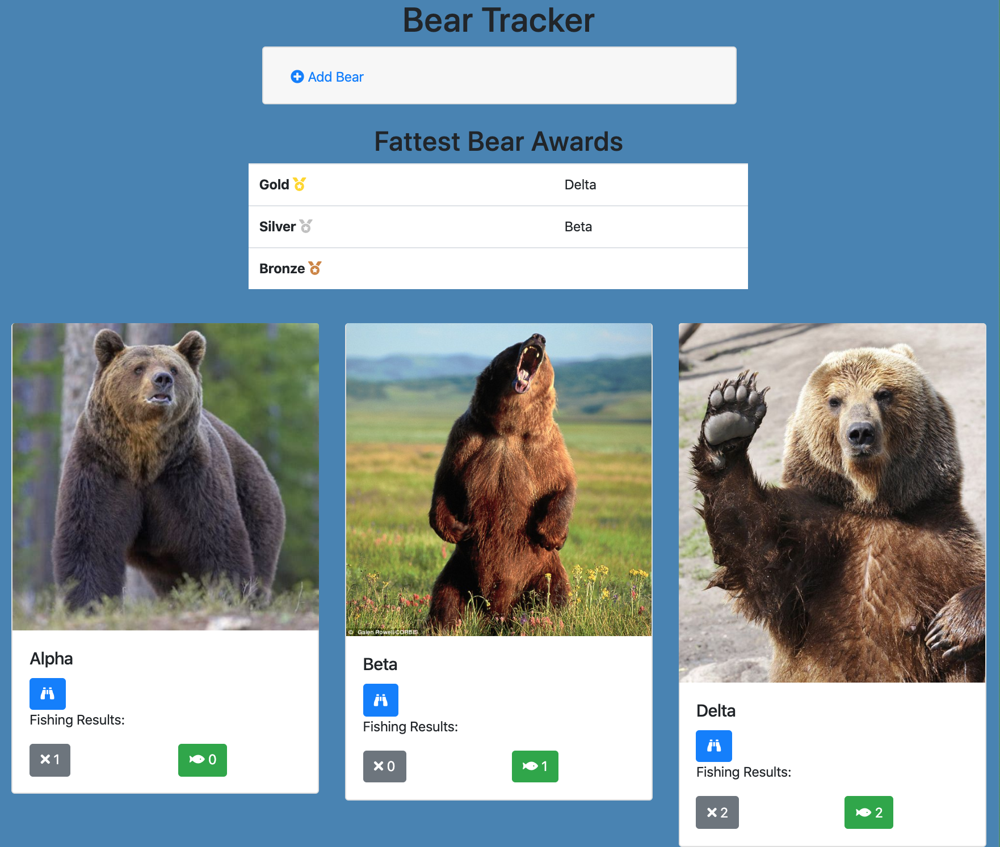
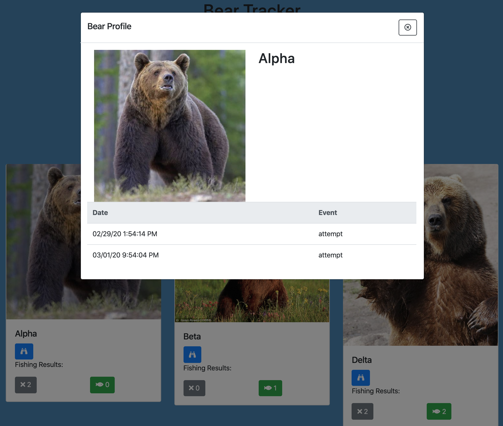

# NSS Exercise: "Bear Tracker"

### Technologies Used:
HTML5, CSS, Vanilla Javascript

### Description:
NSS homework project, which introduces the use of Javascript modules.

Design a web page that displays a grid of cards that show bears.  Scientists and park rangers may use this to add and track bears that feed in on salmon in a particular river.

#### Exercise Requirements
* [Boostrap 4](https://getbootstrap.com/docs/4.0/getting-started/introduction/) for page styling
* All actions on the page must be written within a function
* Proper coding indentation/ readability
* E6 modules
* No errors or warnings in the final code

#### Bonus Challenges Completed
- [x] Buttons on each bear card, that capture whether the bear attempted or successfully caught a fish
- [x] Capture and display timestamped list of all attempts and successful catches for that bear
- [x] Capture and display number of total fish caught
- [x] Fattest Bear Award: An Awards section which displays Gold, Silver, and Bronze for the bears who caught the most fish.  Display same award on multiple bears, in the case of a tie (e.g., two silvers)

### Screenshot:
#### Main View

#### Single Bear Modal

### Instructions to Run:
1. If you do not have npm http-server installed, follow instuctions [here](https://www.npmjs.com/package/http-server) to install on your device
1. Use GitHub's [Cloning Feature](https://help.github.com/en/github/creating-cloning-and-archiving-repositories/cloning-a-repository) to download a local copy of the files for this project
1. In your command line interface, change directory into the folder that contains your copied files
1. Enter command: `http-server -p 8080` or `hs -p 8080`
1. The project will now render in your browser at url: `http://localhost:8080`
